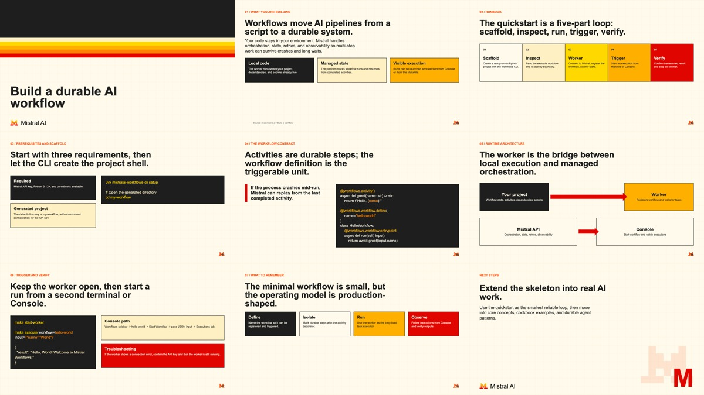

# Mistral Brand Skill

A reusable AI-agent skill for generating Mistral AI branded content: slide decks, PDFs, thumbnails, social cards, one-pagers, diagrams, report covers, and lightweight HTML artifacts.

Repository: https://github.com/sophiamyang/mistral-brand

The skill uses official public Mistral brand assets and public brand guidance from the [Mistral AI brand page](https://mistral.ai/brand). Anything bundled here for branding is public: logo/icon assets, color values, typography guidance, and high-level visual rules. 

## What It Includes

- `SKILL.md` - skill trigger metadata and core workflow
- `references/brand.md` - palette, typography, logo usage, and visual rules
- `references/layouts.md` - presentation layout patterns
- `references/outputs.md` - guidance for PDFs, thumbnails, cards, covers, diagrams, and HTML pages
- `assets/template.html` - starter HTML slide deck
- `assets/content-template.html` - starter thumbnail/card/content artifact
- `assets/mistral-brand-assets/` - official Mistral logo and icon assets
- `examples/build-a-workflow/` - complete generated deck example from a Mistral Docs quickstart
- `scripts/validate_mistral_artifact.mjs` - validates HTML artifacts against core brand rules
- `scripts/export_html_artifact.mjs` - exports HTML artifacts to PDF/PNG when Playwright is available

## Install

### One-line install

```bash
npx skills add https://github.com/sophiamyang/mistral-brand --skill mistral-brand
```

### Agent-assisted install

Paste this into an AI agent with shell access:

```text
Install the `mistral-brand` skill. Clone https://github.com/sophiamyang/mistral-brand.git into my local skills directory as `mistral-brand`, then verify that SKILL.md, assets/, references/, and scripts/ exist.
```

### Manual install

```bash
git clone https://github.com/sophiamyang/mistral-brand.git path/to/skills/mistral-brand
```

Replace `path/to/skills` with your agent runtime's local skills directory.

## Usage

After installation, invoke it explicitly:

```text
Use $mistral-brand to create a Mistral branded PDF from these notes.
```

## Example Prompts

```text
Use $mistral-brand to turn this technical doc into a two-page Mistral branded PDF.
```

```text
Use $mistral-brand to create a 10-slide product overview deck from this outline.
```

```text
Use $mistral-brand to make a 1200x630 thumbnail for this developer tutorial.
```

## Included Examples

### Build a workflow quickstart deck

This repository includes a complete slide deck example generated from the Mistral Docs page [Build a workflow](https://docs.mistral.ai/getting-started/quickstarts/developer/build-a-workflow).



- [HTML source](examples/build-a-workflow/index.html)
- [PDF export](examples/build-a-workflow/mistral-workflow-quickstart.pdf)
- [PowerPoint export](examples/build-a-workflow/mistral-workflow-quickstart.pptx)
- [Contact sheet](examples/build-a-workflow/contact-sheet.jpg)

Preview the HTML example directly:

```text
file:///path/to/mistral-brand/examples/build-a-workflow/index.html
```

Validate the example:

```bash
node scripts/validate_mistral_artifact.mjs examples/build-a-workflow/index.html
```

Export the example to PDF and PNG slides:

```bash
node scripts/export_html_artifact.mjs examples/build-a-workflow/index.html --out examples/build-a-workflow/exported --pdf --png --selector .slide
```

## Validation

Validate generated HTML artifacts with:

```bash
node scripts/validate_mistral_artifact.mjs path/to/artifact.html
```

## Export

Export HTML artifacts to PDF and PNG when Playwright is installed:

```bash
node scripts/export_html_artifact.mjs path/to/artifact.html --out exports --pdf --png --selector .artifact
```

For slide decks, use:

```bash
node scripts/export_html_artifact.mjs path/to/deck.html --out exports --pdf --png --selector .slide
```

## Notes

- Use Arial typography.
- Prefer beige canvases, black text, square geometry, grid structure, and Mistral rainbow accents.
- Syntax-highlight code blocks for technical artifacts.
- Preserve logo aspect ratios.
- Branding reference: https://mistral.ai/brand
- Bundled branding assets and rules are based on public Mistral brand materials.
